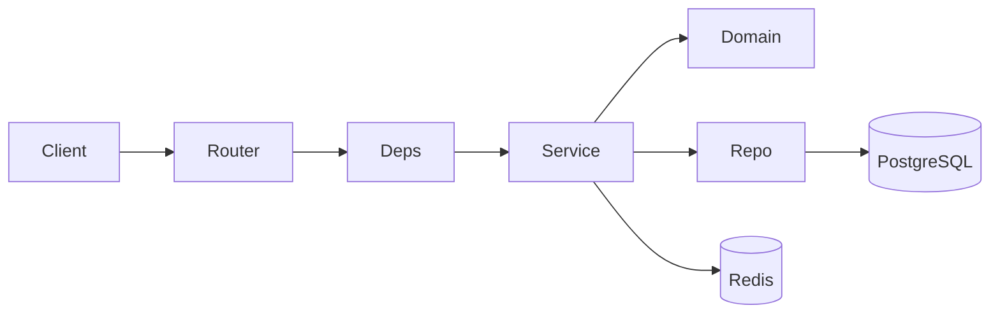

# Architecture

EnglishApp backend follows a layered layout so HTTP concerns stay out of persistence and domain rules.

## Layers

| Layer | Location | Responsibility |
|-------|----------|----------------|
| API | `app/api/` | Routes, auth deps, request/response models |
| Services | `app/services/{users,words,sessions,training,battle,billing}/` | Use cases, transactions (`commit`) |
| Domain | `app/domain/` | Pure rules (progress, scheduling, payloads) |
| Helpers | `app/helpers/` | Access guards, mappers, external IO adapters |
| Repository | `app/repository/` | SQLAlchemy queries only |
| Models / Schemas | `app/models/`, `app/schemas/` | ORM entities and API DTOs |

## Request flow

1. Router resolves the current user and injects a service via `app/api/deps.py`.
2. Service orchestrates repositories and domain helpers; it owns the DB session commit.
3. Failures raise `AppBaseException` subclasses (`NotFoundError`, `ForbiddenError`, …); handlers in `app/core/exceptions/` map them to a consistent JSON shape.

## Domain packages (services)

- **users** — profile, identity, friends, refresh tokens, language sync
- **words** — vocabulary CRUD, AI analysis, confusion pairs, common words
- **sessions** — today session, learning (mixed) session, repeat, discovery, home stats
- **training** — quest exercises (semantic anchor, double recall, …)
- **battle** — battles and matchmaking
- **billing** — usage limits, purchases, RevenueCat webhook parsing

## Background work

Celery tasks under `app/tasks/` handle heavier AI analysis so request handlers stay responsive. Redis backs cache and the Celery broker.
